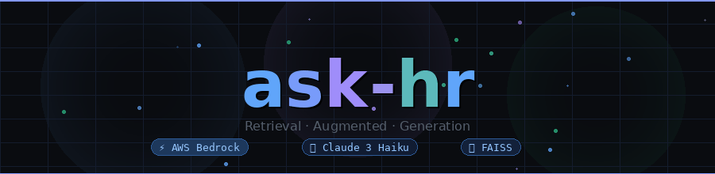
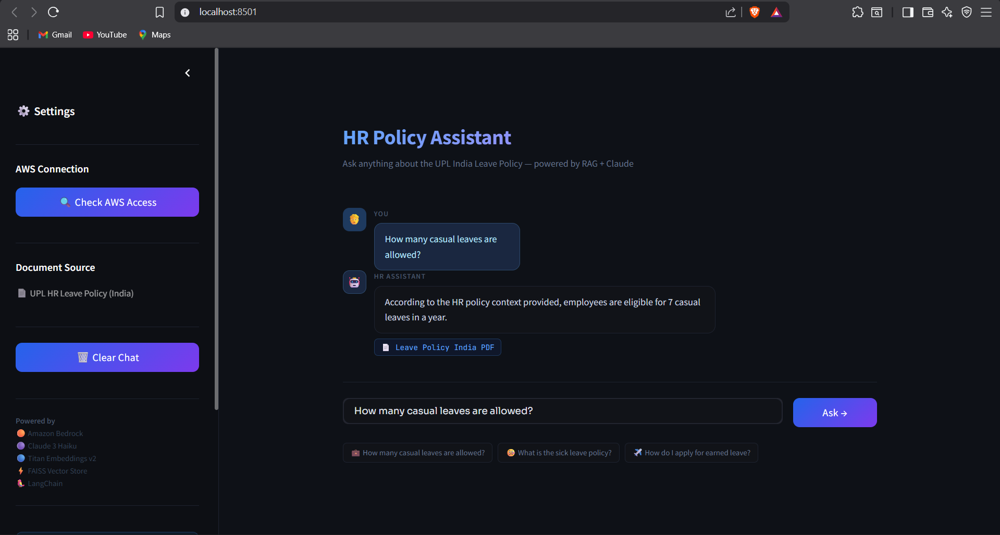

<div align="center">



<br/>

[]()
[]()
[]()
[]()
[]()
[]()

<br/>

> *No more hunting through 40-page PDFs.*
> *Just ask. ask-hr reads, understands, and answers.*

</div>

---

## 📸 Preview

<div align="center">



</div>

---

## 🧠 What is ask-hr?

**ask-hr** is a production-grade HR chatbot built on **Retrieval-Augmented Generation (RAG)**. It ingests your company's leave policy PDF, splits it into semantic chunks, embeds them into a FAISS vector store, and lets employees ask questions in plain English — answered by **Claude 3 Haiku** with context pulled directly from the document.

No hallucinations. No guesswork. Every answer is grounded in your actual HR document.

---

## 🗺️ Pipeline

```
 📄 PDF URL
     │
     ▼
┌──────────────────┐
│   PyPDFLoader    │  fetches + parses the HR policy PDF
└────────┬─────────┘
         │
         ▼
┌──────────────────────────────────┐
│  RecursiveCharacterTextSplitter  │  chunk=500  overlap=50
└────────┬─────────────────────────┘
         │
         ▼
┌────────────────────────────┐
│  Amazon Titan Embed Text   │  dense vector embeddings
│         v2 · Bedrock       │
└────────┬───────────────────┘
         │
         ▼
┌────────────────────────────┐
│    FAISS  Vector Store     │  similarity search across chunks
└────────┬───────────────────┘
         │  ◄── 🧑 Employee asks a question
         ▼
┌────────────────────────────┐
│   Top-K Chunk Retrieval    │  k=4 most relevant sections
└────────┬───────────────────┘
         │
         ▼
┌────────────────────────────┐
│   Claude 3 Haiku · LLM    │  grounded answer generation
│      via AWS Bedrock       │
└────────┬───────────────────┘
         │
         ▼
     ✅  Precise, document-grounded answer
```

---

## 📁 Project Structure

```
ask-hr/
│
├── 🔹 data_load.py          → PDF fetch & load via PyPDFLoader
├── 🔹 data_split_test.py    → Chunk size experiments & validation
├── 🔸 rag_backend.py        → Core pipeline: embed · store · retrieve · answer
├── 🔸 rag_frontend.py       → Streamlit dark-mode chat interface
├── 🖼️  assistant.png         → UI preview screenshot
├── 🎞️  banner.gif            → Animated README banner
└── 📝 README.md
```

---

## ⚙️ Tech Stack

| Layer | Tool | Purpose |
|:---:|:---|:---|
| 📥 | **PyPDFLoader** | Load & parse HR policy PDF from URL |
| ✂️ | **RecursiveCharacterTextSplitter** | Chunk text into 500-token windows |
| 🧬 | **Amazon Titan Embed Text v2** | Convert chunks to dense vectors |
| 🗄️ | **FAISS** | Store vectors, run similarity search |
| 🤖 | **Claude 3 Haiku** (Bedrock) | Generate natural language answers |
| 🔗 | **LangChain RetrievalQA** | Orchestrate the full RAG chain |
| 🌐 | **Streamlit** | Chat UI with dark theme + sidebar |

---

## 🚀 Setup

**① Clone**
```bash
git clone https://github.com/akankshacore/ask-hr.git
cd ask-hr
```

**② Install dependencies**
```bash
pip install langchain langchain-community streamlit faiss-cpu boto3 pypdf
```

**③ Configure AWS**
```bash
aws configure
# AWS Access Key ID     → your key
# AWS Secret Access Key → your secret
# Default region        → ap-south-1
```

**④ Enable Bedrock Model Access**

Go to **AWS Console → Amazon Bedrock → Model Access** and enable:
- ✅ `Amazon Titan Embed Text v2`
- ✅ `Anthropic Claude 3 Haiku`

**⑤ Run**
```bash
streamlit run rag_frontend.py
```

---

## 💬 Example Questions

```
💼  How many casual leaves am I entitled to per year?
🤒  What is the sick leave policy?
✈️   How do I apply for earned leave?
📋  Can unused leaves be carried forward?
📝  What happens to leave balance on resignation?
🗓️   Are there special leaves for maternity/paternity?
```

---

## 🔬 Core Code

```python
# ── Step 1: Load & chunk the HR policy PDF
documents = PyPDFLoader(PDF_URL).load_and_split(
    RecursiveCharacterTextSplitter(chunk_size=500, chunk_overlap=50)
)

# ── Step 2: Embed into FAISS vector store
embeddings = BedrockEmbeddings(model_id="amazon.titan-embed-text-v2:0")
index = FAISS.from_documents(documents, embeddings)

# ── Step 3: Build the RetrievalQA chain
chain = RetrievalQA.from_chain_type(
    llm=BedrockClaudeLLM(model_arn=LLM_ARN),
    retriever=index.as_retriever(search_kwargs={"k": 4}),
    chain_type="stuff",
    chain_type_kwargs={"prompt": hr_prompt_template}
)

# ── Step 4: Ask!
answer = chain.invoke({"query": "How many sick leaves per year?"})["result"]
```

---

## 🛠️ Troubleshooting

<details>
<summary><b>🔴 &nbsp;AccessDeniedException from Bedrock</b></summary>
<br/>

1. Add a payment method → [AWS Billing Console](https://console.aws.amazon.com/billing)
2. Go to **Bedrock → Model Access** → enable Titan v2 + Claude 3 Haiku
3. Wait ~2 minutes, then retry

</details>

<details>
<summary><b>🔴 &nbsp;NoCredentialsError</b></summary>
<br/>

Run `aws configure` in your terminal and enter your Access Key ID and Secret.

</details>

<details>
<summary><b>🔴 &nbsp;Model not found / ResourceNotFoundException</b></summary>
<br/>

This project uses `ap-south-1`. If you're in a different region, update `AWS_REGION` in `rag_backend.py` and re-enable model access there.

</details>

---

## 📄 License

MIT License · Free to use, fork, and build on.

---

<div align="center">

*Made by **Akanksha***

</div>
